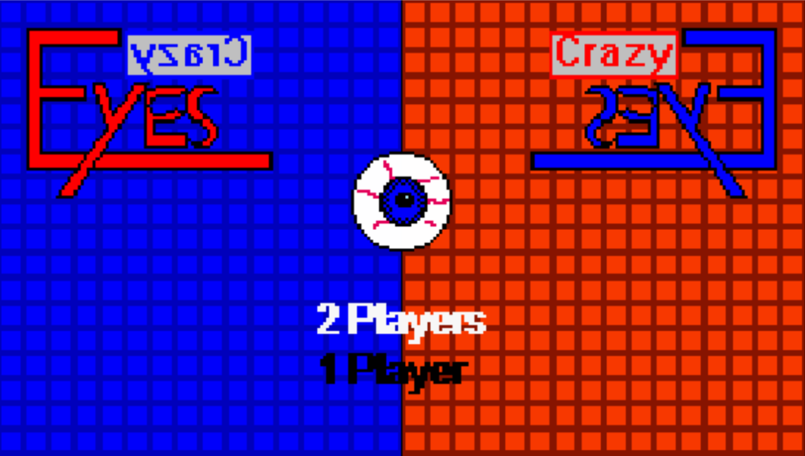
# Eyes Eyes Crazy  

Eyes Eyes Crazy a été créé lors d'une Game Jam qui avait pour thème la Nintendo NES. Nous devions réaliser un jeu respectant les contraintes techniques de la console : couleurs, résolution, sprites ects…

## L'idée :

Je voulais trouver un moyen de faire vivre aux joueurs une expérience plus "moderne", qui aurait été possible à l'époque de la NES.

J'ai donc essayé de créer un jeu multijoueur où chaque joueur dispose d'informations différentes, comme c'est le cas dans un jeu en réseau. Comme les joueurs NES n'ont qu'un seul écran, j'ai utilisé la même technique qu'en 3D stéréoscopique, les lunettes de couleur, qui permettent de voir certains sprites en fonction de leurs couleurs.

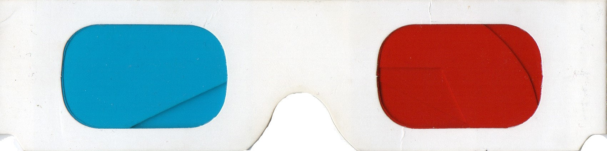
X2

Transformé en :
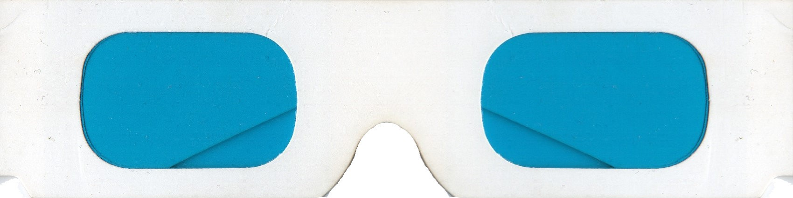
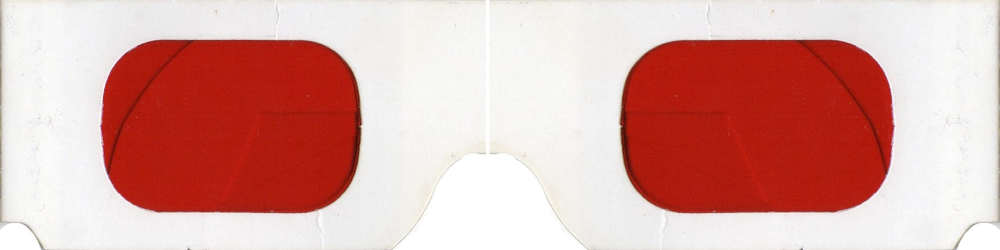

### Couleur du mode Coop:

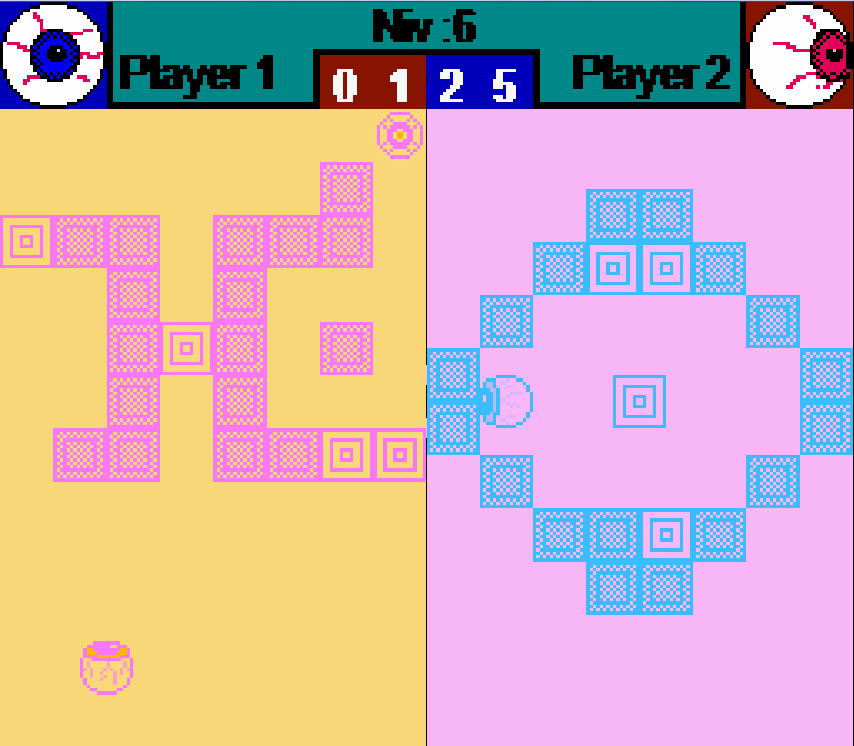

### Couleur du mode solo:

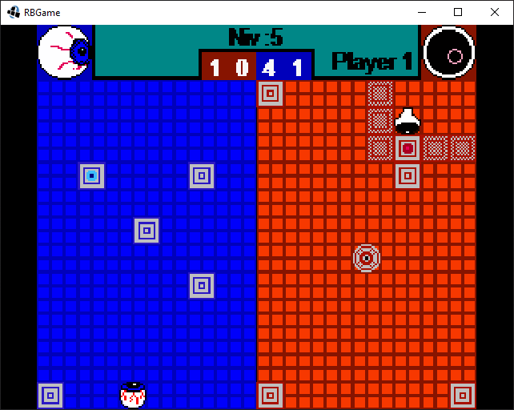

J'ai donc séparé l'écran verticalement en deux et inspiré par le thème "Les mondes connectés" d'un autre thème de Game Jam en cours à l'époque (ludum dare 30) je me suis orienté vers un jeu de puzzle en vue zénithale.  Les éléments d'un monde partagent leur liberté de mouvement avec les éléments de l'autre monde.

## Le but du jeu :

le but est simple, 2 yeux ( Jouables ) bloqués chacun dans leur monde ( Niveau ) doivent coopérer pour en sortir en passant un portail, qui les mène au niveau suivant.

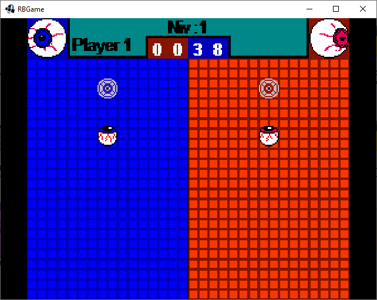

## Les éléments :

- Les caisses : Comme les Seigneurs Sith, les caisses vont par paire. Une caisse dans un monde est jumelée à une autre dans l'autre monde. Le mouvement de l'une entraîne le mouvement de l'autre mais pas forcément dans le même sens. Par contre, elles partagent leur physique, si une caisse est bloquée dans la direction où elle est censée aller, l'autre est également bloquée.

- Le portail : chaque joueur doit étre dessus pour terminer le niveau.

- Les blocs : Ce sont des obstacles inamovibles et infranchissables.

## Les personnages :

J'ai choisi les yeux comme personnages pour plusieurs raisons.. :

- la simplicité de l'animation
- C'est lié aux lunettes
- C'est lié à la dualité du jeu, 2 joueurs reliés par la parole, 2 mondes reliés par les règles du jeu, 2 yeux.
- C'est aussi, je pense, le personnage le plus simple qui peut être expressif.

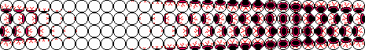

## Actions possibles :

- le personnage peut se déplacer dans les 4 directions,

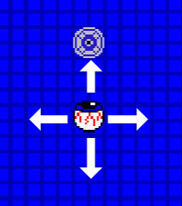

- le personnage peut indiquer la liaison entre 2 caisses

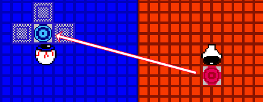

- le personnage peut repousser une caisse.

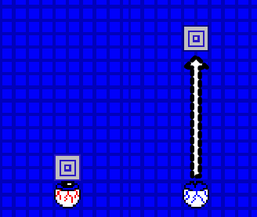

## Contrôle :

| Touche NES | Effet | Joueur 1 | Joueur 2 |
|:----:|:----:|:----:|:----:|
| Haut | monter | Z | fléche Haut | 
| Bas | descendre | S | fléche Bas |
| Droite | aller à droite | D | fléche Droite |
| Gauche | aller à gauche | Q | fléche Gauche |
| Select | Changer d'oeil | E | (uniquement Solo) |
| Start | recommencer le niveau | A | 0 |
| A | télékinésie | J | 7 |
| B | télépathie | I | 8 |

Pour pousser le principe de connexion entre les joueurs, ils jouent sur le même clavier.

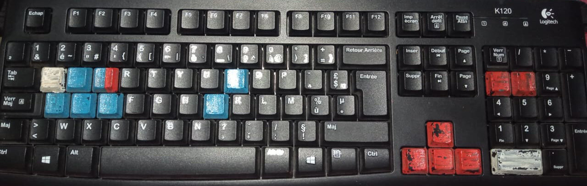

## Commentaires :

- Eyesy Eyes Crazy a un design simple mais le jeu a, je pense, une forte identité.

- L'utilisation de lunettes artisanales en fait un  jeu qui ne peut pas être distribué à grande échelle.

## Améliorations possibles :

- Le jeu peut être transformé en jeu coopératif en ligne, avec l'ajout d'un système de communication simple, par emoji par exemple.

- Le mode solo, où l'on peut passer d'un œil à l'autre, devrait cacher le monde inactif, remplaçant la communication par la mémorisation.

- l'ajout d'une intrigue simple avec quelques dialogues pour renforcer l'identité du jeu.

- une nouvelle version faite avec Unity devrait être assez simple à réaliser, les paramètres de l'éditeur permettent la création d'un éditeur de niveau efficace. La version actuelle est réalisée avec java et libgdx. 

## Télécharger 

jar disponible [ici](https://jonathan-heteau.itch.io/eyes-eyes-crazy)
